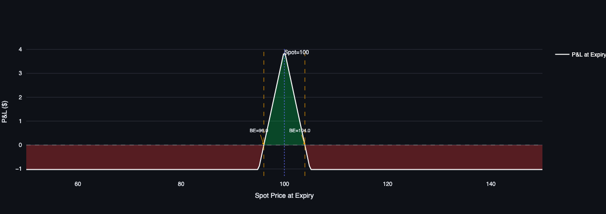

# Options Strategy Simulator

Interactive multi-leg option strategy builder with **SVI volatility smile**, full **Greeks** (delta through volga), and **Monte Carlo simulation** with Student-t fat tails — payoff diagrams, P&L surfaces, and tail-risk analytics.

[](https://options-strategy-simulator.streamlit.app/) [](https://colab.research.google.com/github/louisgay/quant-apps/blob/main/options_strategy_simulator/notebook.ipynb)



---

## Quick Start

```bash
# Local
python -m venv .venv && source .venv/bin/activate
pip install -r requirements.txt
streamlit run app.py

# VRP strategy comparison app
streamlit run simulate_vrp_strategies.py

# Tests
pytest tests/ -v
```

---

## What It Does

Build any multi-leg option position (or pick a preset — straddle, iron condor, butterfly, etc.) and instantly see:

1. **Payoff at expiry** with breakeven points
2. **P&L over time** showing theta decay across DTEs
3. **Portfolio Greeks** (delta, gamma, theta, vega, rho) vs spot and time
4. **Monte Carlo P&L distribution** with VaR, CVaR, and probability of profit

A second app (`simulate_vrp_strategies.py`) compares three volatility-selling strategies — short straddle, iron butterfly, and broken-wing butterfly — across wing widths, maturities, skew levels, and vol regimes.

---

## Pricing Engine

### Black-Scholes with Skew

Each leg is priced with the standard Black-Scholes formula, extended with continuous dividend yield $q$:

$$C = S e^{-qT} \Phi(d_1) - K e^{-rT} \Phi(d_2)$$

$$d_1 = \frac{\ln(S/K) + (r - q + \tfrac{1}{2}\sigma^2)T}{\sigma\sqrt{T}}, \quad d_2 = d_1 - \sigma\sqrt{T}$$

The key extension: $\sigma$ is not a single number. Each strike gets its own implied volatility from the SVI smile, so a 90-strike protective put uses a higher IV than a 110-strike covered call — matching real markets.

All pricing functions are **vectorized** (NumPy broadcasting), so computing Greeks across a 200-point spot range is a single array operation.

### Greeks

Seven Greeks computed analytically per leg, then aggregated across the portfolio:

| Greek | Measures | Formula |
|-------|----------|---------|
| **Delta** | Directional exposure | $e^{-qT} \Phi(d_1)$ (call) |
| **Gamma** | Convexity | $\frac{e^{-qT} \phi(d_1)}{S \sigma \sqrt{T}}$ |
| **Theta** | Time decay (per year) | $-\frac{S e^{-qT} \phi(d_1) \sigma}{2\sqrt{T}} - rKe^{-rT}\Phi(d_2) + qSe^{-qT}\Phi(d_1)$ |
| **Vega** | IV sensitivity | $S e^{-qT} \phi(d_1) \sqrt{T}$ |
| **Rho** | Rate sensitivity | $KT e^{-rT} \Phi(d_2)$ (call) |
| **Vanna** | $\partial\Delta/\partial\sigma$ | $-e^{-qT} \phi(d_1) \, d_2 / \sigma$ |
| **Volga** | $\partial^2 V/\partial\sigma^2$ | Vega $\cdot d_1 d_2 / \sigma$ |

Portfolio Greeks are the signed, quantity-weighted sum across legs. Long = +1, short = −1.

---

## Volatility Smile

### SVI Parameterization

The engine uses Gatheral's SVI (Stochastic Volatility Inspired) model to generate a realistic implied volatility smile:

$$w(k) = a + b \left[ \rho(k - m) + \sqrt{(k - m)^2 + \sigma_{\text{svi}}^2} \right]$$

where $w = \sigma^2 T$ is total implied variance and $k = \ln(K/S)$ is log-moneyness.

Three creation modes:

| Mode | Parameters | Use Case |
|------|-----------|----------|
| `VolSmile.flat(atm_vol)` | ATM vol only | Pure Black-Scholes (no skew) |
| `VolSmile.from_simple(atm_vol, skew, curvature)` | 3 intuitive sliders | Interactive UI |
| `VolSmile.from_raw_svi(a, b, rho, m, sigma)` | 5 raw SVI params | Calibrated surface |

The **simple mode** maps user-friendly inputs to SVI:
- **Skew** (0–1): controls downside steepness — higher skew means OTM puts are more expensive (equity crash premium)
- **Curvature** (0–2): controls how steep the wings are on both sides

**Calendar scaling**: total variance is linear in $T$, so `get_iv_for_strike()` correctly scales IV across different expiries.

**No-arbitrage check**: validates the Gatheral condition $a + b\sigma_{\text{svi}}\sqrt{1 - \rho^2} \geq 0$.

---

## Monte Carlo Simulation

### GBM with Student-t Innovations

Standard Monte Carlo uses Gaussian returns, which underestimate tail events. This engine replaces Normal innovations with **Student-t** distributed shocks:

$$S_T = S \exp\!\left[\left(r - q - \tfrac{1}{2}\sigma^2\right)T + \sigma\sqrt{T}\, Z\right]$$

where $Z \sim t(\nu)$ scaled to unit variance: $Z = Z_{\text{raw}} \cdot \sqrt{(\nu - 2)/\nu}$.

The degrees-of-freedom parameter $\nu$ controls tail fatness:

| $\nu$ | Interpretation | Kurtosis |
|-------|----------------|----------|
| 30 | Near-Gaussian | 3.2 |
| 5 | Moderate fat tails (typical equity) | 9.0 |
| 3 | Heavy tails (stress scenario) | $\infty$ |

### Risk Metrics

For each simulation (default: 50,000 paths):

- **Probability of Profit**: fraction of paths with P&L > 0
- **Expected P&L** and **Median P&L**
- **VaR 95/99**: 5th/1st percentile loss (how bad is a bad day)
- **CVaR 95/99**: expected loss *given* you're in the tail (expected shortfall)
- **Percentile table**: 5th through 95th

---

## Strategy Presets

Nine built-in factories plus a free-form leg builder:

| Strategy | Legs | Outlook |
|----------|------|---------|
| **Straddle** | Long call + long put (ATM) | High vol, direction unknown |
| **Strangle** | Long OTM call + OTM put | Cheaper straddle, wider breakevens |
| **Bull Call Spread** | Long lower call, short higher call | Moderately bullish |
| **Bear Put Spread** | Long higher put, short lower put | Moderately bearish |
| **Butterfly** | 1-2-1 calls (long wings, short body) | Low vol, pinning near strike |
| **Iron Condor** | Bull put spread + bear call spread | Range-bound, collect premium |
| **Collar** | Long put + short call (on stock) | Downside protection |
| **Ratio Spread** | Long 1 call, short N calls (higher) | Mildly bullish, sell vol |
| **Calendar Spread** | Short near-term, long far-term | Theta decay differential |

The VRP comparison app adds three short-vol strategies: **short straddle**, **iron butterfly**, and **broken-wing butterfly** with asymmetric wings.

---

## Architecture

```
options_strategy_simulator/
├── engine/
│   ├── __init__.py        # Public API (30+ exports)
│   ├── pricing.py         # Vectorized Black-Scholes + 7 Greeks
│   ├── vol_surface.py     # SVI smile (flat / simple / raw)
│   ├── strategy.py        # OptionLeg, Strategy, 9 preset factories
│   ├── greeks.py          # Portfolio Greeks aggregation
│   ├── analytics.py       # Payoff, P&L surface, Greeks grids
│   └── monte_carlo.py     # MC with Student-t, VaR/CVaR
├── tests/
│   └── test_engine.py     # 64 tests across 6 test classes
├── app.py                 # Streamlit strategy builder UI
├── simulate_vrp_strategies.py  # VRP strategy comparison app
└── requirements.txt
```

---

## Notes

- **Skew matters for entry cost.** A short iron condor priced with flat vol vs SVI skew can differ by 10–20% in net credit, because the put wing IV is significantly higher than the call wing. The engine handles this by querying `VolSmile.get_iv_for_strike()` per leg.

- **Student-t vs Normal tails.** With $\nu = 5$, the probability of a 3-sigma move is ~1.8% (vs 0.27% under Normal). For short-vol strategies where tail risk is the primary concern, this is the difference between a strategy that looks profitable and one that blows up.

- **P&L surface computation.** The P&L at intermediate times uses full Black-Scholes repricing (not linear interpolation), so time decay is modeled correctly even for complex multi-leg positions with different expirations.

- **Calendar spread handling.** Legs can have different expiration times. The payoff at expiry uses the *shortest* leg's expiry, and at that point the longer-dated leg still has time value computed via Black-Scholes.

---

## Test Suite

```bash
pytest tests/ -v
```

64 tests across 6 classes:

- **Pricing**: put-call parity (with dividends), vectorization, deep ITM/OTM limits, Greeks sign/monotonicity
- **Vol Smile**: flat consistency, skew premium, curvature effect, arbitrage-free validation, calendar scaling
- **Strategy**: payoff shapes (V-shape, tent, bounded), entry cost signs, preset correctness
- **Greeks**: straddle delta ≈ 0, gamma/vega/theta signs for long/short, portfolio aggregation
- **Analytics**: breakeven detection (linear interpolation), P&L surface grid shape, payoff consistency
- **Monte Carlo**: percentile ordering, VaR/CVaR relationships, fat-tail verification (df=3 vs df=30), deterministic seeding, bounded P&L for bounded strategies

---

## References

- Gatheral, J. (2004). *A Parsimonious Arbitrage-Free Implied Volatility Parameterization with Application to the Valuation of Volatility Derivatives.* Presentation at Global Derivatives & Risk Management.
- Black, F. & Scholes, M. (1973). *The Pricing of Options and Corporate Liabilities.* Journal of Political Economy, 81(3).
- Hull, J.C. (2018). *Options, Futures, and Other Derivatives.* 10th Edition, Pearson.

---

## License

MIT
