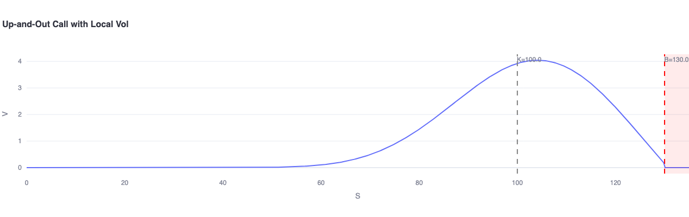

# PDE Option Pricer

[](https://pde-option-pricer.streamlit.app/) [](https://colab.research.google.com/github/louisgay/quant-apps/blob/main/pde_option_pricer/notebook.ipynb)



**Finite-difference PDE solvers for European, American, barrier, and dividend-paying options.**

Interactive Streamlit dashboard with four pricing tabs — Crank-Nicolson, implicit FD with local vol, free-boundary extraction, and Projected SOR — validated against analytical Black-Scholes.

---

## Quick Start

```bash
python -m venv .venv && source .venv/bin/activate
pip install -r requirements.txt
streamlit run app.py

# Tests
pytest tests/ -v
```

---

## Mathematical Framework

### Black-Scholes PDE

$$\frac{\partial V}{\partial t} + \frac{1}{2}\sigma^2 S^2 \frac{\partial^2 V}{\partial S^2} + rS\frac{\partial V}{\partial S} - rV = 0$$

### Crank-Nicolson Discretisation

Using the log-transform $x = \ln S$ and the notation $\nu = r - \frac{\sigma^2}{2}$:

$$A \cdot V^n = B \cdot V^{n+1}$$

where A and B are tridiagonal matrices with coefficients derived from the $\theta = 0.5$ (Crank-Nicolson) scheme:

$$\alpha = \frac{\Delta t}{4}\left(\frac{\sigma^2}{\Delta x^2} - \frac{\nu}{\Delta x}\right), \quad \beta = -\frac{\Delta t}{2}\left(\frac{\sigma^2}{\Delta x^2} + r\right), \quad \gamma = \frac{\Delta t}{4}\left(\frac{\sigma^2}{\Delta x^2} + \frac{\nu}{\Delta x}\right)$$

### American Constraint (Projection)

At each time step: $V^n = \max(V^n_{\text{continuation}},\ \text{payoff})$

### PSOR Update

$$V_i^{(k+1)} = (1-\omega) V_i^{(k)} + \omega \cdot \text{GS}_i, \qquad V_i^{(k+1)} = \max(V_i^{(k+1)},\ \text{payoff}_i)$$

---

## Architecture

```
pde_option_pricer/
├── app.py                  # Streamlit dashboard — 4 tabs
├── engine/
│   ├── __init__.py         # Public API exports
│   ├── models.py           # Dataclasses: PricingResult, BarrierResult, FreeBoundary, ...
│   ├── solvers.py          # 4 PDE solvers (CN, implicit FD, free boundary, PSOR)
│   └── analytics.py        # BS analytical + Greeks + price surface
├── tests/
│   └── test_engine.py      # ~30 tests
├── notebook.ipynb           # Walkthrough with Plotly charts
└── requirements.txt
```

### Notes

- All tridiagonal systems use `scipy.linalg.solve_banded` — O(N) per time step vs O(N³) with dense solves
- Crank-Nicolson operates in log-space so grid points concentrate near the strike where the payoff kink is
- Barrier solver uses implicit FD (not CN) to avoid oscillations near the barrier with spatially-varying local vol

---

## Test Suite

```
pytest tests/ -v
```

| Test class | Count | What it checks |
|-----------|-------|----------------|
| `TestBlackScholes` | 9 | Put-call parity, deep ITM/OTM, vectorisation, Greek signs |
| `TestCrankNicolson` | 7 | CN → BS convergence (<0.5%), PDE put-call parity, American ≥ European |
| `TestBarrierOption` | 5 | Barrier ≤ vanilla, V=0 above barrier, local vol skew |
| `TestFreeBoundary` | 5 | S*(T)=K, boundary < K for put, monotonicity |
| `TestPSOR` | 5 | Convergence, price ≥ intrinsic, dividend reduces call |
| `TestPriceSurface` | 2 | Shape, non-negative |

---

## References

- Black, F. & Scholes, M. (1973). *The Pricing of Options and Corporate Liabilities*. JPE.
- Wilmott, P. (2006). *Paul Wilmott on Quantitative Finance*. Wiley. Chapters 77-80.
- Gatheral, J. (2006). *The Volatility Surface*. Wiley.
- Cryer, C.W. (1971). *The Solution of a Quadratic Programming Problem Using Systematic Overrelaxation*. SIAM.
