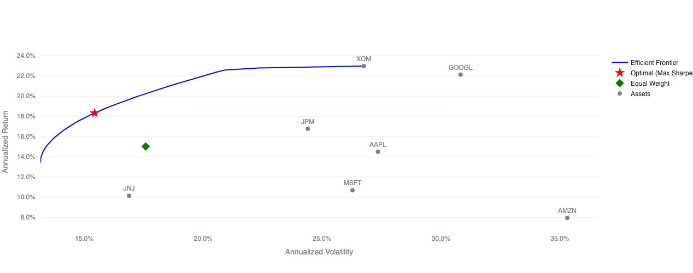

# Portfolio Optimizer

> Interactive portfolio construction with **Markowitz**, **Risk Parity**, and **Black-Litterman** optimization — walk-forward backtesting, Ledoit-Wolf covariance shrinkage, and **Fama-French 6-factor expected returns**.

[](https://quant-portfolio-optimizer.streamlit.app/) [](https://colab.research.google.com/github/louisgay/quant-apps/blob/main/portfolio_optimizer/notebook.ipynb)



---

## Quick Start

```bash
# Docker
docker compose up --build
# Open http://localhost:8501

# Local
python -m venv .venv && source .venv/bin/activate
pip install -r requirements.txt
streamlit run app.py

# Tests
pytest tests/ -v
```

---

## Expected Returns Models

### Historical Mean

The simplest estimator — annualized sample mean of daily log returns:

$$\hat{\mu}_i = \bar{r}_i \times 252$$

Fast and assumption-free, but **noisy**: a few extreme days can dominate the estimate and produce overfitted allocations.

### Fama-French 6-Factor Model

A factor-based alternative that decomposes each asset's returns into exposures to 6 compensated risk premia. For each asset $i$, we run the time-series regression:

$$r_{i,t} - r_{f,t} = \alpha_i + \beta_i^{\text{Mkt}} \cdot \text{MktRF}_t + \beta_i^{\text{SMB}} \cdot \text{SMB}_t + \beta_i^{\text{HML}} \cdot \text{HML}_t + \beta_i^{\text{RMW}} \cdot \text{RMW}_t + \beta_i^{\text{CMA}} \cdot \text{CMA}_t + \beta_i^{\text{Mom}} \cdot \text{Mom}_t + \varepsilon_{i,t}$$

The annualized expected return is:

$$\hat{\mu}_i = \left(\alpha_i + \boldsymbol{\beta}_i^{+} \cdot \overline{\mathbf{f}}\right) \times 252 + \bar{r}_f \times 252$$

where $\boldsymbol{\beta}_i^{+} = \max(\boldsymbol{\beta}_i, 0)$ floors all factor betas at zero — negative exposure to a compensated risk premium is economically irrational for a long portfolio, so we treat it as unexposed rather than penalizing the asset.

| Factor | Description |
|--------|-------------|
| **Mkt-RF** | Market excess return (equity risk premium) |
| **SMB** | Small Minus Big (size premium) |
| **HML** | High Minus Low (value premium) |
| **RMW** | Robust Minus Weak (profitability premium) |
| **CMA** | Conservative Minus Aggressive (investment premium) |
| **Mom** | Momentum (winners minus losers) |

Factor data is downloaded from [Ken French's Data Library](https://mba.tuck.dartmouth.edu/pages/faculty/ken.french/data_library.html) at daily frequency. The same model is used consistently in both the initial optimization and the walk-forward backtest.

---

## Optimization Methods

### 1. Mean-Variance (Markowitz)

Maximizes the Sharpe ratio subject to constraints:

$$\max_w \frac{w^T \mu - r_f}{\sqrt{w^T \Sigma w}} \quad \text{s.t.} \quad \sum_i w_i = 1, \; w_i \geq 0, \; w_i \leq w_{\max}$$

Solved via SLSQP (Sequential Least-Squares Programming). Also computes the full **efficient frontier** across target returns.

### 2. Risk Parity

Equalizes **risk contribution** across assets:

$$\min_w \sum_{i} \left[ \frac{w_i \cdot (\Sigma w)_i}{w^T \Sigma w} - \frac{1}{N} \right]^2 \quad \text{s.t.} \quad \sum_i w_i = 1, \; w_i \geq 0$$

Each asset contributes $1/N$ of total portfolio variance — robust to estimation error in expected returns.

### 3. Black-Litterman

Combines **market equilibrium** with analyst views via Bayes' theorem:

$$\pi = \delta \cdot \Sigma \cdot w_{\text{mkt}}$$

$$\mu_{BL} = \left[(\tau \Sigma)^{-1} + P^T \Omega^{-1} P\right]^{-1} \left[(\tau \Sigma)^{-1} \pi + P^T \Omega^{-1} Q\right]$$

| Symbol | Meaning |
|--------|---------|
| $P$ | View pick matrix (which assets are in the view) |
| $Q$ | View returns vector (what the analyst expects) |
| $\Omega$ | View uncertainty (He-Litterman default: $\text{diag}(P \cdot \tau \Sigma \cdot P^T)$) |
| $\delta$ | Risk aversion coefficient |

The posterior is then fed to the Markowitz optimizer for final weights.

---

## Architecture

```
portfolio_optimizer/
├── engine/
│   ├── data.py           # MarketData + yfinance fetcher + FF factors + Ledoit-Wolf covariance
│   ├── optimizer.py      # MeanVariance, RiskParity, BlackLitterman optimizers
│   └── analytics.py      # Backtester, PortfolioMetrics, drawdown, rolling Sharpe
├── tests/
│   └── test_engine.py    # 60+ tests on synthetic data (no API calls)
├── app.py                # Streamlit dashboard (frontier, weights, backtest)
├── Dockerfile
├── docker-compose.yml
└── requirements.txt
```

### Notes

Ledoit-Wolf shrinkage makes a massive difference — with 7 assets and 2 years of data, raw sample covariance gives min-variance weights of 90% in one asset. Shrinkage to scaled identity brings it back to something reasonable.

Beta flooring at zero is debatable. A negative SMB beta means the stock is large-cap, which is informative, not irrational. But for expected return estimation, letting negative betas subtract from expected return created weird inversions where AAPL had lower expected return than a small-cap stock with half the market premium. Flooring is the lesser evil.

The factor covariance option ($B \Sigma_F B^T + D$) works well when you have many assets relative to observations. For the typical 7-10 asset portfolio in this app, Ledoit-Wolf is fine and simpler.

### Covariance Estimation

Raw sample covariance is **unreliable** when $N_{\text{assets}} / N_{\text{obs}}$ is non-negligible. The engine uses **Ledoit-Wolf shrinkage**:

$$\hat{\Sigma} = \alpha \cdot F + (1 - \alpha) \cdot S$$

where $F$ is a structured target (scaled identity), $S$ is the sample covariance, and $\alpha$ is optimally chosen to minimize expected loss.

### Backtesting Engine

Walk-forward backtesting with:
- **Periodic rebalancing** (monthly, quarterly, or annual)
- **Mark-to-market weight drift** between rebalances
- **Turnover tracking** per rebalance event
- **Benchmark comparison** (equal-weight portfolio + best single asset)
- **Rolling Sharpe** and **drawdown** time series
- **Consistent returns model** — the backtester uses the same expected returns method (historical or FF6) at every rebalance

---

## Test Suite

```bash
pytest tests/ -v
```

60+ tests using **synthetic correlated returns** (no external API dependencies):

- **MarketData**: Shape validation, PSD enforcement, symmetry, correlation matrix
- **Mean-Variance**: Weights sum to 1, long-only constraints, max weight caps, frontier monotonicity
- **Risk Parity**: Equal risk contributions verified numerically
- **Black-Litterman**: No-views recovers equilibrium, views shift posterior correctly
- **Metrics**: Sharpe, drawdown, VaR, CVaR, full report consistency
- **Backtester**: Equity initialization, turnover computation, benchmark tracking

---

## License

MIT
