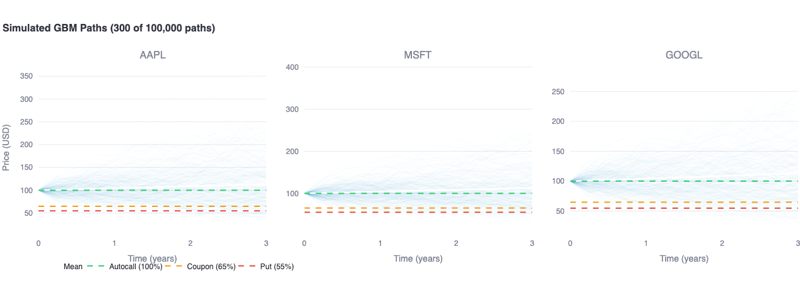

# Structured Product Factory

> Pricing engine for **Autocallable Phoenix & Athena** notes on multi-asset worst-of baskets — Monte Carlo simulation, Greeks, and correlation risk analysis.

[](https://structured-pricing-factory.streamlit.app/) [](https://colab.research.google.com/github/louisgay/quant-apps/blob/main/structured_product_factory/notebook.ipynb)



---

## Quick Start

```bash
# Docker (recommended)
docker compose up --build
# Open http://localhost:8501

# Local
python -m venv .venv && source .venv/bin/activate
pip install -r requirements.txt
streamlit run app.py

# Tests
pytest tests/ -v
```

---

## Products

### Autocallable Phoenix (Worst-of)

At each observation date, the **worst performer** in the basket determines the payoff:

| Event | Condition | Cash Flow |
|-------|-----------|-----------|
| **Autocall** | Worst-of >= Autocall Barrier (e.g. 100%) | Early redemption at par + coupon |
| **Coupon** | Worst-of >= Coupon Barrier (e.g. 65%) | Periodic coupon paid (memory: unpaid coupons catch up) |
| **Maturity — protected** | Worst-of >= Put Barrier (e.g. 55%) | Par redemption |
| **Maturity — loss** | Worst-of < Put Barrier | Capital loss proportional to worst performer |

**Example term sheet:**

| Parameter | Value |
|-----------|-------|
| Underlyings | AAPL, MSFT, GOOGL |
| Notional | USD 1,000,000 |
| Maturity | 3 years |
| Observation | Quarterly |
| Autocall Barrier | 100% |
| Coupon Barrier | 65% |
| Coupon Rate | 7.0% p.a. |
| Put Barrier | 55% |
| Memory | Yes |

### Autocallable Athena

Simpler variant — no intermediate coupon payments. Instead, coupons **accrue linearly** and pay out only upon autocall: `coupon = rate * time_elapsed`. If the product reaches maturity without autocall, no coupon is paid.

---

## Mathematical Framework

### Correlated GBM Dynamics

Each asset follows risk-neutral geometric Brownian motion:

$$\frac{dS_i}{S_i} = (r - q_i) \, dt + \sigma_i \, dW_i$$

where $\text{Corr}(dW_i, dW_j) = \rho_{ij}$. Correlation is injected via **Cholesky decomposition**:

$$\mathbf{W} = \mathbf{Z} \cdot L^T, \quad \text{where} \quad L L^T = \mathbf{C}$$

This guarantees mathematically consistent correlated paths across any number of assets.

### Price Decomposition

The product value decomposes into four additive components:

$$V = V_{\text{ZCB}} + V_{\text{Coupons}} + V_{\text{Put}}$$

$$\text{where} \quad V_{\text{ZCB}} = V_{\text{ZCB\_maturity}} + V_{\text{Autocall\_option}}$$

| Component | Description | Sign |
|-----------|-------------|------|
| $V_{\text{ZCB}}$ | Discounted par redemption (at autocall or maturity) | Positive |
| $V_{\text{Autocall\_option}}$ | Early redemption premium vs. holding to maturity | Positive |
| $V_{\text{Coupons}}$ | Barrier-contingent periodic payments (with memory) | Positive |
| $V_{\text{Put}}$ | Capital loss below put barrier at maturity | Negative |

The decomposition is **verified to machine precision** ($< 10^{-6}$) in every pricing run.

### Correlation Risk — Why It Matters

When a bank issues a worst-of autocallable, it takes on **short correlation exposure**:

- **Correlation drops** $\rightarrow$ worst performer diverges further from the basket $\rightarrow$ more barrier breaches, lower autocall probability, higher expected losses
- **Correlation rises** $\rightarrow$ assets move together $\rightarrow$ fewer barrier breaches, higher autocall probability

This project quantifies that risk by repricing under systematic correlation shocks ($-20\%$ to $+20\%$), producing a **correlation P&L profile** usable for risk limits and hedging.

To keep the bumped correlation matrix valid, the engine applies **eigenvalue flooring** ($\lambda_{\min} \geq 10^{-8}$) followed by diagonal renormalization — guaranteeing positive semi-definiteness after every bump.

### Greeks via Central Finite Differences

All Greeks use central differences for second-order accuracy:

$$\Delta_i = \frac{V(S_i + h) - V(S_i - h)}{2h}$$

$$\Gamma_i = \frac{V(S_i + h) - 2V(S_i) + V(S_i - h)}{h^2}$$

$$\mathcal{V}_i = \frac{V(\sigma_i + \delta\sigma) - V(\sigma_i - \delta\sigma)}{2 \, \delta\sigma}$$

Each bump triggers a full MC repricing with the same random seed for variance reduction.

---

## Architecture

```
structured_product_factory/
├── engine/
│   ├── market_data.py      # MarketData container + spot/vol/corr bump methods
│   ├── monte_carlo.py      # Cholesky-decomposed correlated GBM simulation
│   ├── products.py         # Phoenix & Athena payoff logic + decomposition
│   └── greeks.py           # Finite-difference Greeks + correlation sensitivity
├── tests/
│   └── test_engine.py      # 38 tests (MarketData, MC, payoffs, decomposition, Greeks)
├── app.py                  # Streamlit dashboard (pricing, paths, Greeks, correlation)
├── notebook.ipynb           # Step-by-step walkthrough
├── Dockerfile
├── docker-compose.yml
└── requirements.txt
```

### Notes

Eigenvalue flooring for correlation bumps was the fix I spent the most time on — naively adding to off-diagonals breaks PSD, and Cholesky just throws a `LinAlgError` with no useful message. The current approach (floor eigenvalues at 1e-8, then renormalize diagonal to 1) is simple and works reliably.

Central FD for Greeks is straightforward but requires 6 full MC repricings per asset for delta+gamma+vega. AAD would be better but overkill here.

The decomposition consistency check (ZCB + Coupons + Put = Total) runs on every pricing call. It's caught real bugs — an off-by-one in the coupon observation schedule showed up as a 0.3% decomposition mismatch.

---

## Test Suite

```bash
pytest tests/ -v
```

The test suite covers:

- **MarketData validation** — shape checks, symmetry, PSD enforcement, bump immutability
- **Monte Carlo convergence** — $\mathbb{E}[S_T] = S_0 \cdot e^{(r-q)T}$ verified to 1% tolerance at 500k paths
- **Payoff correctness** — zero-vol analytical edge cases (deterministic autocall at first observation)
- **Decomposition consistency** — $V_{\text{ZCB}} + V_{\text{Coupons}} + V_{\text{Put}} = V_{\text{Total}}$ to machine precision
- **Component signs** — $V_{\text{ZCB}} > 0$, $V_{\text{Coupons}} \geq 0$, $V_{\text{Put}} \leq 0$, $V_{\text{Autocall}} \geq 0$
- **Athena-specific** — coupon proportional to time elapsed, no coupon at maturity without autocall
- **Greeks signs** — $\Delta \geq 0$ (higher spot $\rightarrow$ more autocall), $\mathcal{V} < 0$ (higher vol $\rightarrow$ more downside)
- **Correlation sensitivity** — returns correct structure across bump scenarios

---

## License

MIT
