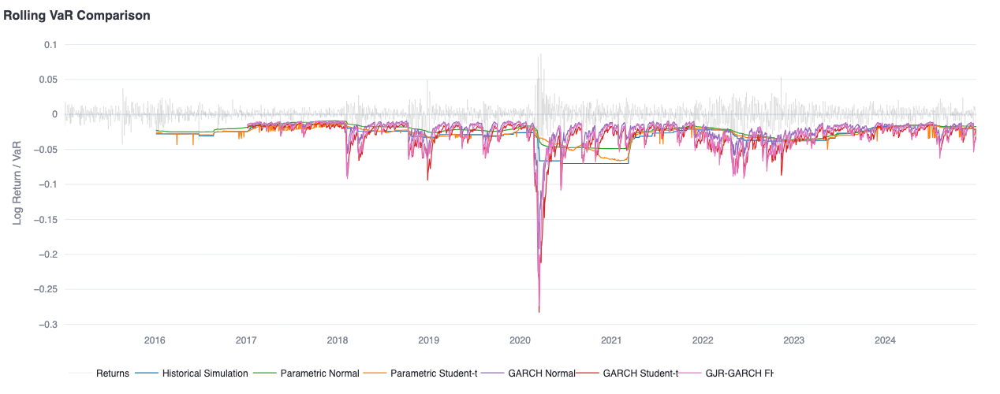

# VaR Risk Models

6 VaR methods compared: empirical quantile → GJR-GARCH FHS. Backtested with Kupiec/Christoffersen.



```bash
pip install -r requirements.txt
streamlit run app.py
```

## Methods

| # | Method | Key idea |
|---|--------|----------|
| 1 | Historical Simulation | Empirical quantile, no assumptions |
| 2 | Parametric Normal | Gaussian — baseline, underestimates tails |
| 3 | Parametric Student-t | MLE-fitted df per window |
| 4 | GARCH(1,1) Normal | Vol clustering via conditional variance |
| 5 | GARCH(1,1) Student-t | + fat tails (isolates distributional effect) |
| 6 | GJR-GARCH FHS | Leverage + non-parametric MC tails (Barone-Adesi 1999) |

## GJR-GARCH + FHS

$$\sigma_t^2 = \omega + \alpha \varepsilon_{t-1}^2 + \gamma \varepsilon_{t-1}^2 \mathbb{1}(\varepsilon_{t-1} < 0) + \beta \sigma_{t-1}^2$$

FHS: fit GJR → extract z_t → bootstrap z* → propagate sigma → r* = mu + sigma * z* → quantile of {r*}.

## Structure

```
engine/
├── data_loader.py   # Alpaca + yfinance
├── garch.py         # GJR-GARCH, NIC, FHS simulation
├── var_models.py    # 6 rolling VaR methods (+1 analytical variant)
├── backtest.py      # Kupiec, Christoffersen, combined LR tests
└── plots.py         # Plotly figures
tests/
└── test_var_models.py
```

## References

- Glosten, Jagannathan & Runkle (1993), *Journal of Finance* 48(5)
- Kupiec (1995), *Journal of Derivatives* 3(2)
- Christoffersen (1998), *International Economic Review* 39(4)
- Barone-Adesi, Giannopoulos & Vosper (1999), *Journal of Futures Markets* 19(5)
