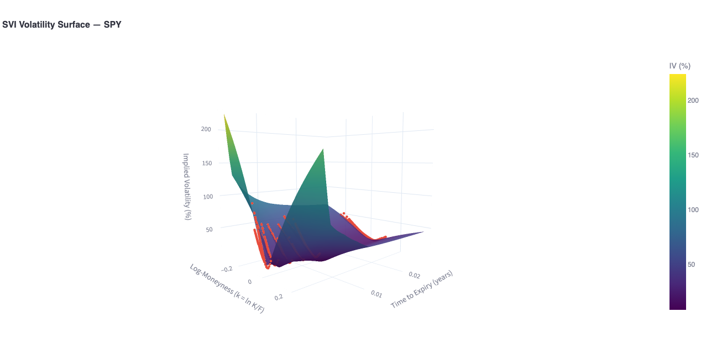

# Volatility Surface Calibrator

> Build, calibrate, and visualize **implied volatility surfaces** using the SVI (Stochastic Volatility Inspired) model on live equity option chains.

[](https://vol-surface-calibrator.streamlit.app/) [](https://colab.research.google.com/github/louisgay/quant-apps/blob/main/vol_surface_calibrator/notebook.ipynb)



---

## Quick Start

```bash
# Docker
docker compose up --build
# Open http://localhost:8501

# Local
python -m venv .venv && source .venv/bin/activate
pip install -r requirements.txt
streamlit run app.py

# Tests
pytest tests/ -v
```

---

## Pipeline

```
Yahoo Finance Option Chains
        |
        v
  Data Cleaning          Filter by OI >= 50, volume >= 5, moneyness 80-120%,
        |                bid-ask spread < 80% of mid
        v
  IV Computation         Brent's root-finding on Black-Scholes (calls & puts)
        |                Bounds: [0.01%, 500%], filtered to [1%, 300%]
        v
  SVI Calibration        Per-slice fit: w(k) = a + b[rho(k-m) + sqrt((k-m)^2 + sigma^2)]
        |                SLSQP + differential evolution fallback
        v
  Surface Assembly       Linear interpolation of total variance across maturities
        |
        v
  3D Visualization       Plotly interactive surface (strike x maturity x IV)
```

---

## Mathematical Framework

### Black-Scholes Pricing

The Black-Scholes call price is:

$$C(S, K, T, r, \sigma) = S \cdot N(d_1) - K e^{-rT} \cdot N(d_2)$$

where:

$$d_1 = \frac{\ln(S/K) + (r + \sigma^2/2) T}{\sigma \sqrt{T}}, \qquad d_2 = d_1 - \sigma \sqrt{T}$$

Given a market price $C^{\text{mkt}}$, we invert this formula numerically to find the **implied volatility** $\sigma_{\text{impl}}$.

### The SVI Parameterization

The SVI model (Gatheral, 2004) expresses total implied variance $w(k, T)$ as a function of log-moneyness $k = \ln(K/F)$:

$$w(k) = a + b \left[ \rho (k - m) + \sqrt{(k - m)^2 + \sigma^2} \right]$$

| Parameter | Role | Typical Range |
|-----------|------|---------------|
| $a$ | Overall variance level | $[-0.5, \, 0.5]$ |
| $b$ | Wing slope (controls how fast vol grows in tails) | $[0.01, \, 1.0]$ |
| $\rho$ | Skew (negative = put skew, typical for equities) | $[-0.99, \, 0.99]$ |
| $m$ | Horizontal shift of the smile minimum | $[-0.5, \, 0.5]$ |
| $\sigma$ | ATM curvature (controls smile width at-the-money) | $[0.01, \, 1.0]$ |

### No-Arbitrage Conditions

**Gatheral slice condition** (no negative variance):

$$a + b \cdot \sigma \cdot \sqrt{1 - \rho^2} \geq 0$$

This is enforced as a constraint during optimization.

**Calendar-spread condition** (no free money across maturities):

$$w(k, T_1) \leq w(k, T_2) \quad \forall \, k, \; T_1 < T_2$$

Guaranteed by interpolating in **total variance** space rather than implied volatility.

**Butterfly arbitrage condition** — the local volatility must be non-negative:

$$g(k) = \left(1 - \frac{k \, w'(k)}{2 w(k)}\right)^2 - \frac{w'(k)^2}{4}\left(\frac{1}{w(k)} + \frac{1}{4}\right) + \frac{w''(k)}{2} \geq 0$$

### Implied Volatility via Brent's Method

Given a market price $C^{\text{mkt}}$, we solve:

$$C^{BS}(S, K, T, r, \sigma) = C^{\text{mkt}}$$

using Brent's bracketed root-finding algorithm. Unlike Newton-Raphson, Brent's method:
- **Always converges** (no vega blow-up issues on deep OTM options)
- Requires only function evaluations, not derivatives
- Bounded search in $[0.01\%, \, 500\%]$

---

## Architecture

```
vol_surface_calibrator/
├── engine/
│   ├── data_fetcher.py      # yfinance integration + option chain cleaning
│   ├── iv_calculator.py     # Black-Scholes pricer + Brent IV solver
│   └── svi_model.py         # SVISlice, SVICalibrator, SVISurface
├── tests/
│   └── test_engine.py       # BS parity, IV round-trip, SVI recovery, surface tests
├── app.py                   # Streamlit dashboard with 3D Plotly surface
├── notebook.ipynb           # Pedagogical walkthrough (17 cells)
├── README.md
├── Dockerfile
├── docker-compose.yml
└── requirements.txt
```

### Notes

SLSQP alone wasn't enough for short-dated smiles (T < 30d). The optimizer kept finding local minima where rho and m compensated each other. Differential evolution as a global search fallback solved it, at the cost of ~10x slower calibration per slice.

Total variance interpolation between maturities was a deliberate choice — interpolating sigma directly breaks calendar-spread no-arbitrage because $\sigma^2 T$ isn't guaranteed to be monotone in T even when $\sigma$ is interpolated linearly. Working in $w = \sigma^2 T$ space makes this free.

Brent over Newton-Raphson for the IV solver was worth it. Deep OTM options have vega near zero, so Newton steps blow up. Brent is slower per iteration but never fails.

---

## Test Suite

```bash
pytest tests/ -v
```

Covers:
- **Black-Scholes**: Call-put parity $C - P = S - K e^{-rT}$, ITM/OTM pricing, zero-vol edge case
- **Implied volatility**: Round-trip recovery for calls and puts ($\sigma \to C \to \sigma$)
- **SVI model**: Total variance at ATM, wing behavior, positive volatility, arbitrage-free check
- **SVI calibration**: Parameter recovery on synthetic smiles, full surface calibration
- **Surface grid**: IV evaluation across strike-maturity grid

---

## References

- Gatheral, J. (2004). *A parsimonious arbitrage-free implied volatility parameterization with application to the valuation of volatility derivatives.*
- Gatheral, J. & Jacquier, A. (2014). *Arbitrage-free SVI volatility surfaces.*

---

## License

MIT
